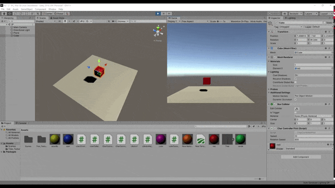
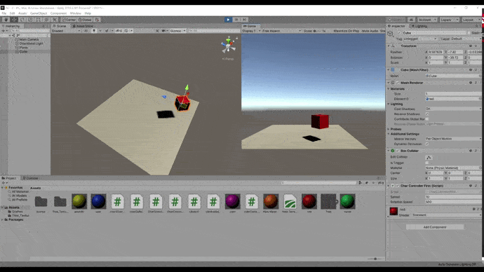
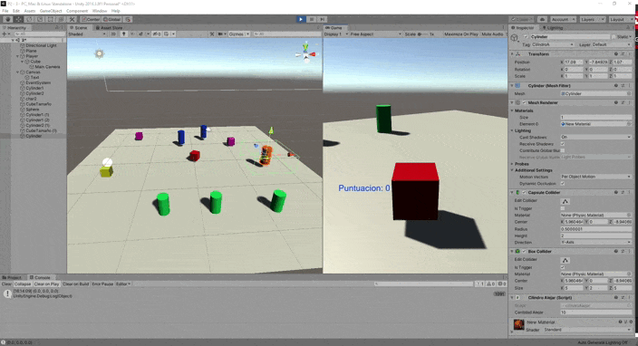
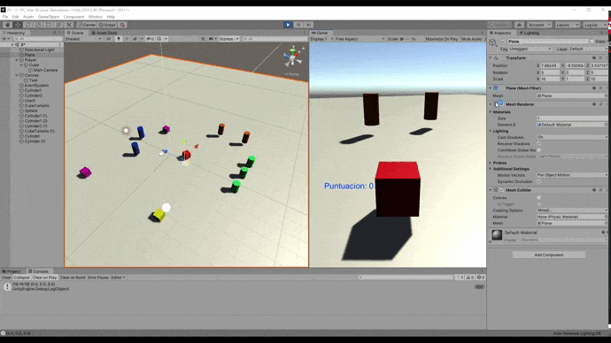
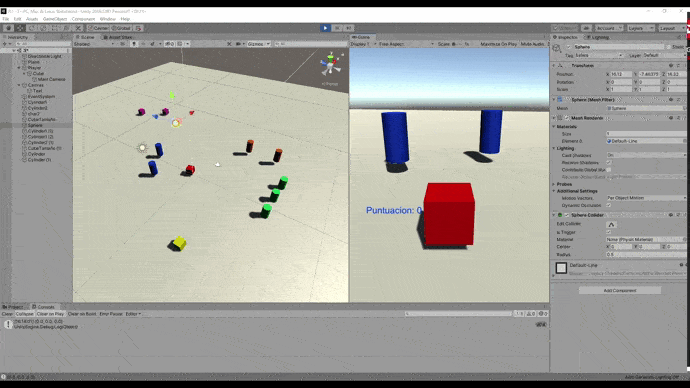
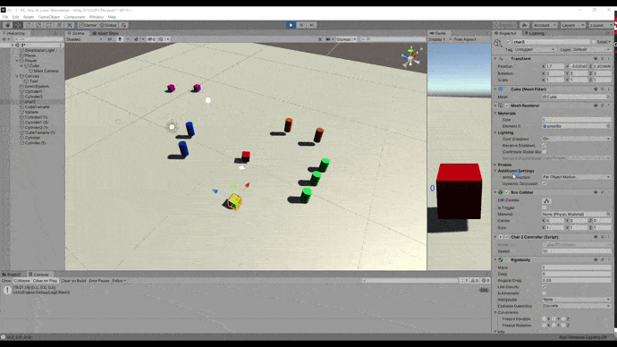
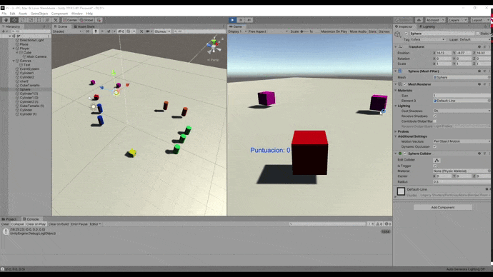

# II_pr2

## 1: 

### a: Ninguno de los objetos será físico: Los dos objetos se quedan estaticos en el aire.
### b: La esfera tiene fisicas, el cubo no: El cubo se queda estatico en el aire y la esfera se cae.
### c: La esfera y el cubo tiene fisicas: El cubo y la esfera se caen.
### d: La esfera y el cubo tiene fisicas, esfera tiene 10 veces las masa del cubo: El cubo y la esfera caen a la misma velocidad.
### e: La esfera El cubo tiene IsTrigger: La esfera cae y el cubo se queda estatico. 
### f: La esfera y el cubo tienen fisicas y El cubo tiene IsTrigger: Los dos objetos caen pero el cubo atraviesa el plano. 
### g: La esfera y el cubo tienen fisicas. Esfera con 10 veces mas masa que el cubo y se impide la rotaicon del cubo sobre el plano XZ: La esfera y el cubo caen a la misma velocidad. Al impedir la rotacion del cubo sobre el plano XZ, el cubo caera pero al chocar contra el plano no podra rotar sobre su eje X ni sobre su eje Z. 

## 2:

### a: Script para desplazar al personaje. El script se llama CharControllerFirst

 

### b: Campo público para graduar la velocidad del personaje

 

### c: Usar Ejes virtuales.

## 3: 

### 1: Incluir varios cilindros los cuales cuando el jugador choque contra ellos aumenten su tamaño y aumente la puntuacion del jugador. Se ha usado el tag "Cilindro1" para agruparlos. Esto se implementa en el script CharController

 

### 2: Cilindros de tipo A. Estos se alejarán del jugador cuando este esté cerca y pulse espacio. Se ha usado el tag "CilindroA" para agruparlos. Se detecta si el jugador esta cerca en el script CharController (en realidad se detecta si el cilindro esta cerca del jugador, que es lo mismo) y se alejan los cilindros usando la funcion alejar del script cilindroAlejar (el objeto jugador tiene el script CharController y el cilindro el script cilindroAlejar)

 

### 3: Cilindros que huyan del jugador cuando se acerque. Se ha usado el tag "Cilindro2" para agruparlos. Se detecta si el jugador esta cerca en el script CharController (en realidad se detecta si el cilindro esta cerca del jugador, que es lo mismo) y se alejan los cilindros usando la funcion alejar del script cilindroAlejar (el objeto jugador tiene el script CharController y el cilindro el script cilindroAlejar)

 

### 4: Ubicar un tercer objeto (un cuadrado) que detecte colisiones y se mueva con las teclas I, L, J, M. Esto se implementa en el script Char2Controller

 

### 5: Cubos que aumenten de tamaño cuando se acerca una esfera y disminuyan cuando se acerca el jugador. Esto se implementa en el script cuboTamanio

 

